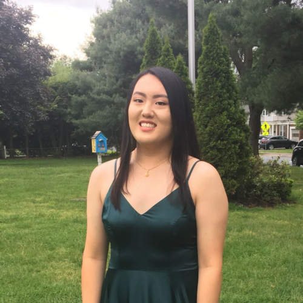

{::options parse_block_html="true" /}

# About

## We're different.

Most hackathons are for college students or professionals. MAHacks strives to expand these platforms to youth by welcoming high school students of all backgrounds in Massachusetts and beyond. Too often, however, we see projects of little use being generated at hackathons, or projects being promptly abandoned. To combat this, MAHacks features Tracks and invites industry leaders to present students with real-world problems. Through this, participants are able to tackle specific issues, and can continue their projects through our opportunities for mentorship, accelerators, and experiential learning.

## Meet the Team

### Jolene Pern
_Andover High School ‘20_

Jolene is a rising senior from Andover, MA. She is extremely passionate about ensuring that MAHacks is welcoming to anyone who wants to explore their interest in technology. At school, Jolene does several other activities that channel her love for diversifying the field of STEM, such as robotics and programming. Outside of science and tech, Jolene enjoys writing random motivational quotes in calligraphy and drinking boba tea!

### Theo Bleier

_Westborough High School '22_

Theo is a rising sophmore from Westborough, MA. He's deeply passionate about empowering students to [learn how to hack](https://hackclub.com/philosophy/), and spends most of his time [organizing](https://hackpenn.com) [hackathons](https://windyhacks.com), working on [Hack Club Bank](https://hackclub.com/bank), and building other projects. On the rare occasion that he's not at a computer, he's either hanging out with his pets or playing the saxophone.

### Vicki Yang
_Needham High School ‘20_

Vicki is a rising senior from Needham, MA. She is super excited to welcome people to MAHacks and create a collaborative environment for other high schoolers to learn more about STEM. Aside from being an organizer of MAHacks, Vicki is a member of the HackHers FTC team and is co-president of the Biobuilders club. In her limited free time, Vicki also likes to play video games (like League of Legends) and read.

### Jonathan Yin

_Acton Boxborough Regional High School '20_

Jonathan is a rising senior from Acton, MA. He is excited to foster interest in STEM and share his passions with others in his community. In addition to being an MAHacks organizer, he is co-captain of his school's Science Olympiad team and conducts research through the MIT PRIMES program. In his free time, he enjoys programming, 3D-printing, and playing chess.

### Kunal Sharda

_Acton Boxborough Regional High School ‘20_

Kunal is a rising senior from Acton, MA. He loves all things entrepreneurship and is enthusiastic about MAHacks’ mission to make innovation more accessible. In fact, during MAHacks III, he had the opportunity to build a project that eventually emerged into his startup, Scintillating, which has allowed him to raise funding, meet with prominent clients, and speak at prestigious institutions. Outside of his company, he spends time leading his local robotics team and actively participating in green energy initiatives. He enjoys tennis, video games, and playing with his labradoodle, Zuko!

### Matt Tengtrakool

_Burlington High School '21_

Matt is a rising junior from Burlington, Ma.  He is thrilled to help facilitate passions around technology.  Matt strives to spread STEM learning within the community.  He is the founder of BHS Mu Alpha Theta an active member in the Math League and the technology program.   He also enjoys to help other students as the co-president of peer tutoring and treasurer of student council.  His hobbies include swimming, tennis and the saxophone.

### Michelle Yu

_Newton South High School ‘21_

Michelle is a rising junior from Newton, MA. She is very passionate about creating opportunities in her community to spread STEM. Aside from MAHacks, Michelle is a member of her school's FRC robotics team and the president of the Technovation club at her school. Michelle also loves anything that has to do with mechanics and penguins (maybe not together though).

### Jocelyn Pern

_Andover High School '22_

Jocelyn is a rising sophomore from Andover, MA. She is especially eager about making sure MAHacks’ message inspires curious high schoolers to channel their talents into a project that positively impacts the world. During and after school, Jocelyn immerses herself in STEM activities, such as FIRST robotics and programming, Outside of STEM, Jocelyn loves to build jigsaw puzzles and solve a variety of Rubik’s cubes.

## Alumni

- Justin Yu
- Max Krieger
- Edward Song
- Nimish Garg
- Jennifer Kim
- Katherine Huang
- Emily Tan
- Walter Shen
- Zhi Wei Gan
- Rebekah Agwunobi
- Aadhya Puttur
- Nina Zhang

## About the Website

Social media icons are from [flaticon.com](http://flaticon.com) and licensed by [CC 3.0 BY](http://creativecommons.org/licenses/by/3.0/).
